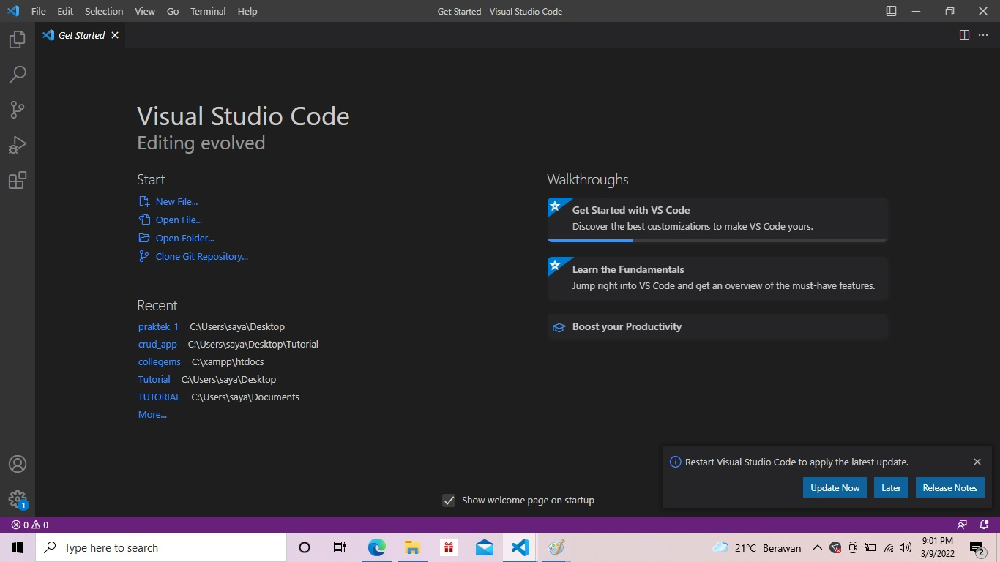
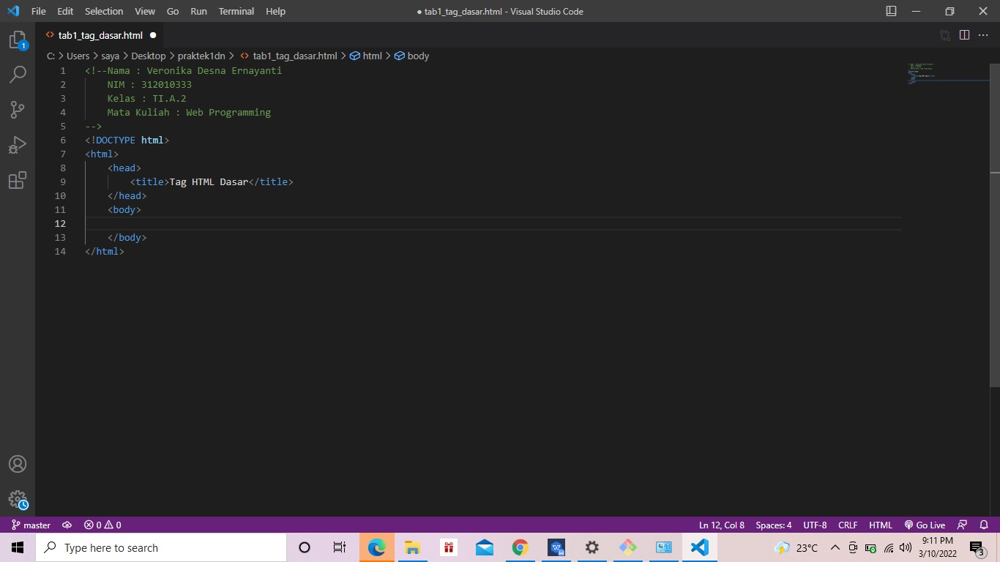
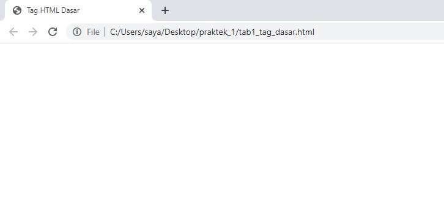
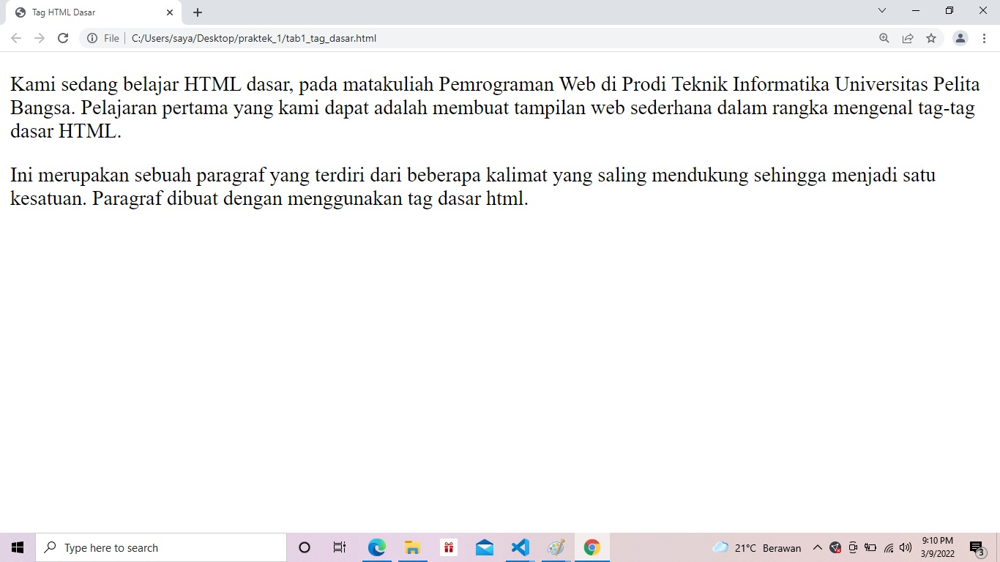
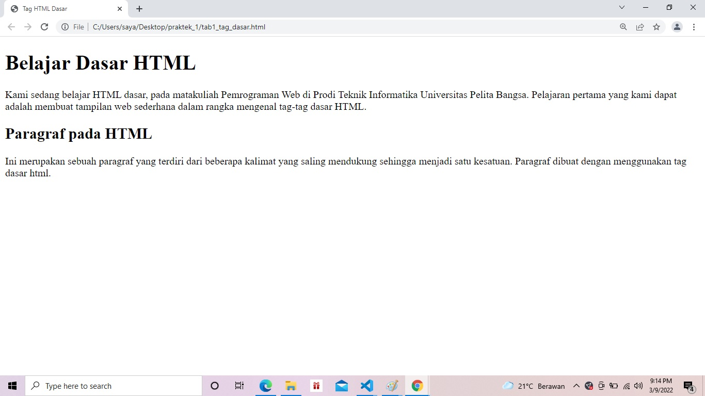
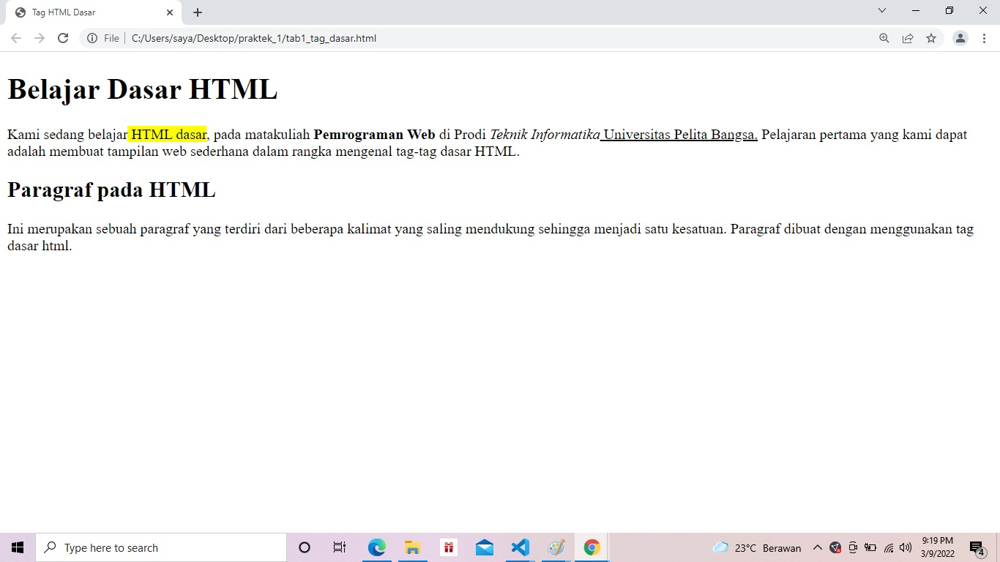
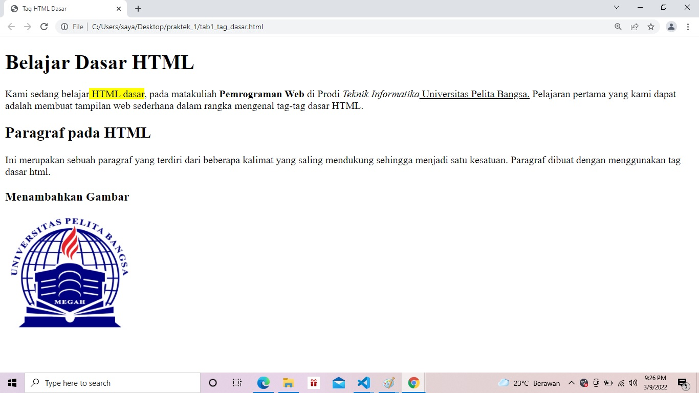
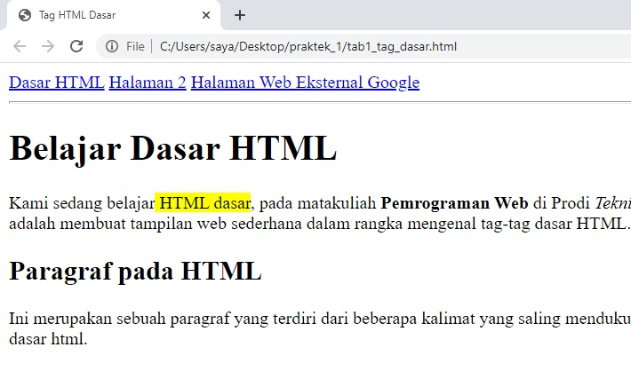

# Lab1Web
###### Nama : Veronika Desna Ernayanti Fau
###### NIM : 312010333
###### Kelas : TI.A.2

## TugasPertamaWebProgramming

Instruksi Praktikum
1. Persiapkan text editor misalnya VSCode.
2. Buat file baru dengan nama lab1_tag_dasar.html
3. Buat struktur dasar dari dokumen HTML.
4. Ikuti langkah-langkah praktikum yang akan dijelaskan berikutnya.
5. Lakukan validasi dokumen html dengan mengakses http://validator.w3.org

Langkah-langkah Praktikum
Persiapan membuka VSCode dan Browser.

**Gambar Tampilan VSCode**

Kemudian buat file baru dengan nama lab1_tag_dasar.html dan tambahkan tag dasar dokumen HTML.

## **Modul Praktikum Pemrograman Web**

**Gambar Code HTML Dasar**

Kemudian selanjutnya, buka file tersebut pada web browser misalnya Mozilla Firefox.

**Gambar Web Browser Chrome**

1. Membuat Paragraf
Selanjutnya buatlah beberapa paragraf sederhana sebagai berikut

Selanjutnya simpan kembali perubahannya, dan lakukan refresh pada web browser, lihat hasilnya

**Gambar Tampilan Paragraf pada Browser**

Kemudian atur atribut paragraf seperti berikut, dan amati perubahanya.

Simpan kembali dan amati perubahannya dengan melakukan refresh pada web browser. 
Selanjutnya silakan ubah-ubah nilai atributnya (align => justify, left, right, dan center) untuk melihat 
perbedaan lainnya. 

2. Menambahkan Judul
Seperti sudah dijelaskan pada materi bahwa judul memiliki 6 level yaitu mulai h1 sampai h6. 
Kemudian tambahkan judul h1 sebelum paragraf pertama dan tambahkan sub judul h2 sebelum 
paragraf kedua.

Simpan perubahannya dan lihat hasilnya dengan melakukan refresh pada browser

**Gambar Tampilan Heading 1 dan Heading 2**

3. Memformat teks
Lakukan pemformatan teks yang ada pada paragraf yang sudah ada sebelumnya, mengacu kepada 
penjelasan materi pemformatan teks, sehingga tampilannya seperti berikut.

**Gambar Pemformatan Teks**

Lakukan eksperimen lainnya dengan tag-tag pemformatan teks yang ada.

4. Menyisipkan Gambar
Untuk menyisipkan gmbar, siapkan gambar yang akan disisipkan pada halaman web, kemudian 
simpan file gambar tersebut satu folder dengan file dokumen html. Atau bisa juga menyisipkan 
gambar dari website external

Kemudian tambahkan tag img setelah paragraf yang kedua, dengan menambahkan heading 3
sebelumnya.

Simpan perubahannya, kemudian refresh browser.

**Gambar Menampilkan Gambar**.

Gambar akan ditampilkan apa adanya sesuai dengan ukuran aslinya. Untuk mengatur ukuran 
gambar, dapat digunakan atribut witdh dan height dengan nilai integer yang disesuaikan.

5. Menambahkan Hyperlink
Tambahkan hyperlink pada dokumen sebelum heading 1 seperti berikut.

**Gambar Tampilan Hyperlink**

## JAWAB PERTANYAAN BERIKUT

1. Lakukan perubahan pada kode sesuai dengan keinginan anda, amati perubahannya adakah 
error ketika terjadi kesalahan penulisan tag?
2. Apa perbedaan dari tag **p** dengan tag **br**, berikan penjelasannya!
3. Apa perbedaan atribut title dan alt pada tag **img**, berikan penjelasannya!
4. Untuk mengatur ukuran gambar, digunakan atribut width dan height. Agar tampilan gambar 
proporsional sebaiknya kedua atribut tersebut diisi semua atau tidak? Berikan penjelasannya!
5. Pada link tambahkan atribut target dengan nilai atribut bervariasi ( _blank, _self, _top, 
_parent ), apa yang terjadi pada masing-masing nilai antribut tersebut?

###### JAWAB!
1. Pada saat menggunakan kode tidak terdapat error jika menggunakan kode dengan benar, jika terjadi typo ataupun kurangnya huruf atau tanda maka terjadi error pada kode yang dibuat.
   
2. Tag  **p** Tag ini berfungsi untuk memberi perintah paragraf baru pada halaman html, biasa digunakan untuk membuat sebuah paragraph pada HTML.
Tag **br** dituliskan pada kerangka html untuk memberikan perintah "break line", artinya meng intruksikan baris baru.
   
3. a.  Alt text atau text alternatif adalah atribut yang ditambahkan ke tag gambar dalam HTML. Teks ini muncul di dalam wadah gambar ketika gambar tidak dapat ditampilkan. Ini membantu mesin pencari memahami apa isi dari gambar tersebut. Text alternatif juga sangat membantu dalam kasus gambar yang tidak ditemukan pada halaman atau gambar rusak.
   b. Title image adalah atribut lain yang dapat ditambahkan ke tag gambar dalam HTML. Title image ini digunakan untuk memberikan judul untuk gambar Anda. Text yang Anda masukkan di dalam tag judul tidak akan ditampilkan kepada pengguna ketika gambar tidak dapat ditampilkan. Sebaliknya, tag judul gambar ini ditampilkan saat Anda menyorot gambar dengan mouse.
   
4. Lebih baik diisi karena pembuat program dapat mengatur ukuran gambar secara panjang dan lebar gambar, dan tidak semua gambar pada html mempunyai ukuran yang langsung ideal untuk ditampilkan terkadang gambar terlalu besar atau terlalu kecil, maka dari itu lebih baik menggunakan height dan weight pada gambar/logo di HTML.
   
5. a. 
 **a href="link" target="_self">penamaan link/a** 
untuk membuka link di frame link itu berada. ini merupakan setelan dasar link jika pada elemen link tidak diberi atribut target 

 b. 
 **a href="link" target="_blank">penamaan link/a** 
untuk membuka link di tab baru 

 c. 
 **a href="link" target="_parent">penamaan link/a** 
untuk membuka link di frame yang satu tingkat di atas frame link tersebut berada. secara simple-nya begini : jika di website(1) di dalamnya ada website(2) lalu di website(2) ini ada link dan kita klik, maka link akan terbuka di website(1) 

 d.. 
 **a href="link" target="_top">penamaan link/a** 
untuk membuka link di frame paling atas (paling luar). secara simpel-nya : jika di website(1) di dalamnya ada website(2) lalu di website(2) di dalamnya ada website (3) lalu di website (3) ini ada link dan kita klik, maka link akan terbuka di website(1)

